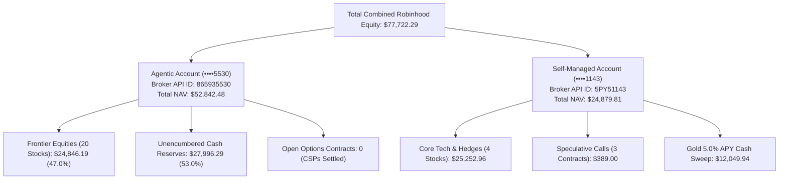

# Dual-Account Broker Snapshot & Comprehensive Portfolio Audit

*Last Reconciled: September 30, 2026 (Live Direct Robinhood Broker Sync via robin_stocks)*  
*Broker ID: User `g0dz` (`jgodgart@gmail.com`) · Total Combined Wealth: **$77,722.29***

---

## 1. Top-Level Dual-Account Architecture

Jake Godgart operates two distinct, real Robinhood brokerage accounts under the same login credentials. Each account serves an entirely separate strategic purpose and must **never** share or bleed holdings across boundaries:

### Combined Portfolio Allocation Matrix

| Account Name | Robinhood Account Number | Total Net Equity (NAV) | Equities Value | Options Value | Cash / Sweep Reserves | Strategic Mandate |
| :--- | :--- | :---: | :---: | :---: | :---: | :--- |
| **Self-Managed** | `5PY51143` (`••••1143`) | **$24,879.81** | $25,252.96 *(4 stocks)* | $389.00 *(3 calls)* | $12,049.94 *(5% APY)* | Core wealth compounders & manual macro hedges |
| **Agentic** | `865935530` (`••••5530`) | **$52,842.48** | $24,846.19 *(20 stocks)* | $0.00 *(0 open)* | $27,996.29 *(Ready)* | Autonomous frontier tech & CSP income engine |
| **COMBINED WEALTH** | **Both Accounts** | **$77,722.29** | **$50,099.15** *(24 stocks)* | **$389.00** *(3 calls)* | **$40,046.23** | **Total Liquid Wealth** *(Zero PLTR Owned)* |

---

## 2. Agentic Account Audit (`865935530` · \$52,842.48 Total NAV)
*Total Stocks: **20 Verified Positions** · Value: **$24,846.19** · Unencumbered Cash: **$27,996.29***

### Master Holdings Table: All 20 Real Frontier Stocks

| # | Symbol | Company / Asset Name | Shares Held | Live Price | Market Value | % Port | Cost Basis | Total P/L ($) | Total Return (%) | Thesis Role & Category |
| :---: | :--- | :--- | :---: | :---: | :---: | :---: | :---: | :---: | :---: | :--- |
| 1 | **ASML** | ASML Holding NV | 1.6569 | $1,834.86 | $3,040.26 | 5.75% | $1,810.56 | +$40.26 | +1.34% | Advanced EUV Lithography Monopoly |
| 2 | **IONQ** | IonQ, Inc. | 51.7736 | $43.90 | $2,272.60 | 4.30% | $42.98 | +$47.60 | +2.14% | Trapped-Ion Commercial Quantum |
| 3 | **RXRX** | Recursion Pharmaceuticals | 464.7676 | $4.03 | $1,870.69 | 3.54% | $3.34 | +$320.69 | **+20.69%** | AI Drug Discovery & Supercomputing |
| 4 | **CEG** | Constellation Energy | 6.8236 | $264.64 | $1,805.80 | 3.42% | $278.45 | −$94.20 | −4.96% | Nuclear Clean Baseload (Microsoft PPA) |
| 5 | **RKLB** | Rocket Lab USA | 25.3318 | $69.72 | $1,766.14 | 3.34% | $78.95 | −$233.86 | −11.69% | Orbital Space Launch & Satellite Buses |
| 6 | **TEM** | Tempus AI | 19.4432 | $82.62 | $1,606.40 | 3.04% | $55.23 | +$532.55 | **+49.59%** | Precision Oncology & Healthcare AI |
| 7 | **MU** | Micron Technology | 1.4476 | $1,065.40 | $1,542.24 | 2.92% | $880.79 | +$267.24 | **+20.96%** | High-Bandwidth Memory (HBM3E) for AI |
| 8 | **ROBO** | Robotics & Automation ETF | 18.3671 | $80.45 | $1,477.54 | 2.80% | $84.39 | −$72.46 | −4.67% | Global Industrial Automation Index |
| 9 | **ARKG** | Genomic Revolution ETF | 24.7191 | $53.94 | $1,333.35 | 2.52% | $44.50 | +$233.35 | **+21.21%** | CRISPR Gene-Editing & Molecular Med |
| 10 | **ONDS** | Ondas Holdings | 146.7459 | $7.49 | $1,099.13 | 2.08% | $9.39 | −$279.14 | −20.25% | Autonomous Drone Defense (Optimus) |
| 11 | **ASTS** | AST SpaceMobile | 15.9247 | $59.42 | $946.25 | 1.79% | $69.08 | −$153.75 | −13.98% | Space Direct-to-Cell Cellular Network |
| 12 | **PHO** | Water Resources ETF | 13.6558 | $68.33 | $933.10 | 1.77% | $73.29 | −$67.74 | −6.77% | Water Scarcity & Semiconductor Pure Water |
| 13 | **QBTS** | D-Wave Quantum | 50.0000 | $16.45 | $822.50 | 1.56% | $9.99 | +$323.00 | **+64.66%** | Commercial Quantum Annealing |
| 14 | **INOD** | Innodata Inc. | 12.0000 | $66.91 | $802.92 | 1.52% | $62.50 | +$52.98 | +7.06% | AI Data Engineering & Hyperscaler RLHF |
| 15 | **MP** | MP Materials | 16.5411 | $45.44 | $751.63 | 1.42% | $54.41 | −$148.37 | −16.49% | US Mountain Pass Rare Earth Mine |
| 16 | **BETA** | Beta Technologies | 30.6515 | $22.45 | $687.97 | 1.30% | $24.47 | −$62.03 | −8.27% | Electric Aviation & Commercial Cargo |
| 17 | **RGTI** | Rigetti Computing | 43.0000 | $15.78 | $678.54 | 1.28% | $18.06 | −$97.83 | −12.60% | Superconducting Quantum Chips (Fab-1) |
| 18 | **AUR** | Aurora Innovation | 117.6051 | $5.40 | $634.48 | 1.20% | $7.02 | −$190.52 | −23.09% | Autonomous Class 8 Semi-Trucks |
| 19 | **ARKX** | Space & Defense ETF | 19.5200 | $31.91 | $622.78 | 1.18% | $34.58 | −$52.22 | −7.74% | Orbital Defense & Space Systems Breadth |
| 20 | **JOBY** | Joby Aviation | 103.1519 | $5.99 | $617.88 | 1.17% | $8.73 | −$282.12 | −31.35% | Commercial eVTOL Air Taxi (Toyota backed) |
| **TOTAL** | **20 Stocks** | **Frontier Equity Sleeve** | — | — | **$24,846.19** | **47.0%** | **$24,534.61** | **+$311.58** | **+1.27%** | **Intact Thematic Portfolio** |

### Individual Status Briefing for Every Frontier Holding

1. **ASML (ASML Holding NV):** Global monopoly on Extreme Ultraviolet (EUV) photolithography scanners ($200M+ per tool). Every cutting-edge AI chip designed by Nvidia or Apple must be printed on ASML hardware. Holding is profitable (+$40) and acts as the portfolio's core hardware foundation.
   > 💡 **What this means:** ASML builds the only machines in the world capable of printing advanced computer chips. Nobody else can make them. It is the unshakeable bedrock of your portfolio.

2. **IONQ (IonQ, Inc.):** Trapped-ion quantum pioneer with systems accessible on AWS, Azure, and Google Cloud. Trapping individual atoms with lasers delivers higher physical precision and room-temperature stability. Profitable (+$48) and consolidating near highs.
   > 💡 **What this means:** Quantum computers solve chemistry and physics problems that regular supercomputers can't finish in thousands of years. IonQ is a leading pioneer, sitting on a solid profit.

3. **RXRX (Recursion Pharmaceuticals):** Merging robotic cellular wet-labs with Nvidia BioNeMo supercomputers to map disease biology in software. Surged +8.78% today to $4.03, lifting total return to +20.69% (+$321 profit).
   > 💡 **What this means:** Instead of scientists spending 10 years mixing chemicals in test tubes by hand, Recursion uses supercomputers to run millions of virtual medical tests every day. It's up over 20% and is a massive winner in your account.

4. **CEG (Constellation Energy):** America's largest nuclear generator. Signed a historic 20-year Power Purchase Agreement with Microsoft to restart Three Mile Island Unit 1 (Crane Clean Energy Center), dedicating 835 MW of round-the-clock carbon-free power for AI datacenters. Down -4.96% in a healthy consolidation.
   > 💡 **What this means:** AI datacenters require massive 24/7 power that wind and solar can't supply. Constellation is the king of nuclear energy and already has Microsoft locked in for 20 years. The 5% dip is an attractive buying opportunity.

5. **RKLB (Rocket Lab USA):** Established #2 orbital launcher behind SpaceX. Electron rocket has completed dozens of orbital missions; reusable Neutron rocket will enter service for commercial constellations and Space Force payloads. Down -11.69% during post-launch digestions.
   > 💡 **What this means:** Rocket Lab is the only reliable company besides SpaceX that sends satellites into orbit. They also build satellite parts for NASA. Their multi-billion-dollar backlog makes them a long-term compounder.

6. **TEM (Tempus AI):** Bridges genomic sequencing and clinical oncology records to help doctors pick customized cancer therapies. Gained +49.59% (+$533 profit). Nearing the Frontier 1.5× Winner Trim threshold (+50%).
   > 💡 **What this means:** Tempus uses AI to match cancer patients with the exact therapies that will work best on their specific tumor DNA. You bought at $55 and it's now $82.62, giving you nearly a 50% profit. Selling a few shares soon will lock in real cash while letting the rest compound.

7. **MU (Micron Technology):** High-Bandwidth Memory (HBM3E) leader supplying memory stacks for Nvidia H200 and Blackwell B200 AI GPUs. Capacity is completely sold out through 2026. Profitable (+20.96% / +$267 gain).
   > 💡 **What this means:** AI chips cannot think fast unless they have super-fast memory right next to them. Micron makes the specialized ultra-fast memory stacks that go inside Nvidia AI hardware. They are sold out for the next year and have generated you a 21% profit.

8. **ROBO (Robo Global Robotics & Automation ETF):** Diversified ETF holding factory automation, robotic surgical equipment, machine vision, and logistics sensors. Down -4.67%.
   > 💡 **What this means:** Rather than guessing which single robot manufacturer will win, this fund buys a diversified basket of the best factory automation and robotics companies around the globe.

9. **ARKG (ARK Genomic Revolution ETF):** Gene editing (CRISPR/Cas9), base editing, and molecular diagnostics ETF. Up +21.21% (+$233 gain).
   > 💡 **What this means:** ARKG invests in companies that rewrite human DNA to permanently cure hereditary genetic diseases like sickle cell and muscular dystrophy. It's up +21% and gives you broad exposure to futuristic biotech breakthroughs.

10. **ONDS (Ondas Holdings):** Autonomous "drone-in-a-box" systems (Optimus) for perimeter defense, counter-UAS interception, and military base monitoring. Down -20.25% due to small-cap contract volatility.
    > 💡 **What this means:** Ondas builds smart drones that live in weatherproof boxes and launch themselves to patrol military bases and oil facilities. The stock has pulled back -20%, but it is a small speculative position designed to capture military defense contracts.

11. **ASTS (AST SpaceMobile):** Direct-to-cell space constellation connecting standard consumer smartphones to orbital cell towers. Five BlueBird satellites on orbit undergoing phased-array calibration with AT&T and Verizon. Down -13.98%.
    > 💡 **What this means:** AST SpaceMobile puts giant cellular towers in space so your ordinary phone gets cellular reception in the middle of the ocean, deserts, or mountains with zero dead zones. The stock is down -14% as they test their first batch of satellites, offering an attractive spot to accumulate before service goes live.

12. **PHO (Invesco Water Resources ETF):** Municipal water treatment, infrastructure, and purification systems required for chip fabrication and datacenter cooling. Down -6.77%.
    > 💡 **What this means:** Computer chips and AI datacenters require millions of gallons of purified water to stay cool and clean. PHO owns the companies that build water pipes, pumps, and purification systems. It's a defensive safety net for your portfolio.

13. **QBTS (D-Wave Quantum):** Commercial quantum annealing systems solving combinatorial logistics, scheduling, and routing optimization. Your top percentage gainer (+64.66% / +$323 profit).
    > 💡 **What this means:** D-Wave makes quantum computers that find the absolute best solution among billions of possibilities (like figuring out the optimal way to schedule thousands of factory machines). You bought at $9.99 and it's now $16.45, giving you a huge +65% gain.

14. **INOD (Innodata Inc.):** AI data engineering and reinforcement learning from human feedback (RLHF) powering models for 5 of the 7 mega-cap tech hyperscalers. Profitable (+7.06% / +$53 gain).
    > 💡 **What this means:** To make AI models like ChatGPT and Gemini smart, companies need armies of doctors, lawyers, and coders to review and clean data. Innodata provides high-grade training data to the world's biggest tech companies and is profitable and growing.

15. **MP (MP Materials):** Owner and operator of Mountain Pass in California—the only integrated rare earth mine and refining site in North America. Backed by Department of Defense Title III grants to secure domestic supply of NdPr magnets for military guidance systems and EVs. Down -16.49%.
    > 💡 **What this means:** Rare earth minerals are vital for making missile guidance systems, radar, and electric cars. China controls most of the world's supply, but MP Materials owns America's only active rare earth mine. While the stock is down -16%, the Pentagon is backing them to make sure the US military has its own supply.

16. **BETA (Beta Technologies):** Electric aircraft developer focusing on electric conventional (eCTOL) and vertical takeoff (eVTOL) cargo logistics for UPS and the US Air Force. Down -8.27%.
    > 💡 **What this means:** Beta builds battery-powered electric airplanes for cargo delivery and military medical flights. Unlike competitors promising flying passenger taxis tomorrow, Beta is smartly focusing first on cargo packages for UPS. It's a small, manageable bet in your portfolio.

17. **RGTI (Rigetti Computing):** Full-stack quantum company developing multi-chip modular superconducting processors manufactured at its Fab-1 facility in California. Down -12.60%.
    > 💡 **What this means:** Rigetti designs and manufactures its own quantum chips in California using superconducting circuits that are chilled to temperatures colder than outer space. It's a second bet on quantum computing alongside IonQ.

18. **AUR (Aurora Innovation):** Autonomous driving system (Aurora Driver) designed for commercial 18-wheeler Class 8 semi-trucks on the Dallas-to-Houston corridor in partnership with FedEx. Down -23.09%.
    > 💡 **What this means:** Aurora builds self-driving software for giant 18-wheeler semi-trucks so freight can haul non-stop between cities like Dallas and Houston. While the stock has dropped -23%, the position is tiny and offers long-term upside as driverless freight routes expand.

19. **ARKX (ARK Space & Defense Innovation ETF):** Institutional ETF holding orbital aerospace platforms, defense satellite systems, and geospatial mapping providers. Down -7.74%.
    > 💡 **What this means:** ARKX owns a basket of space-age companies building satellites, military drones, and space imaging systems. It gives you broad exposure to the commercial space boom without having to pick individual winners.

20. **JOBY (Joby Aviation):** Commercial electric air taxi developer with over $1 billion in liquidity, backed by Toyota and Delta Air Lines. Stage 4 FAA certification progress leads the industry. Down -31.35%.
    > 💡 **What this means:** Joby builds quiet electric air taxis designed to fly commuters over city traffic jams (like Manhattan to JFK in 7 minutes). The stock is down -31% because getting airplane approvals from the government takes time, but they have over $1 billion in the bank and Toyota as their main partner.

---

## 3. Self-Managed Account Audit (`5PY51143` · \$24,879.81 Total NAV)
*Total Stocks: **4 Positions** ($25,252.96) · Options: **3 Long Calls** ($389.00) · Cash Sweep: **$12,049.94***

### Master Holdings Table: Self-Managed Account

| Symbol | Asset Name | Shares / Qty | Current Price | Total Value | % Account | Cost Basis | Dollar P/L | Return (%) | Strategic Mandate |
| :--- | :--- | :---: | :---: | :---: | :---: | :---: | :---: | :---: | :--- |
| **CRWD** | CrowdStrike Holdings | 40.00 shs | $262.74 | $10,509.60 | 42.24% | $87.42 | **+$7,012.96** | **+200.56%** | Cloud Security Falcon Platform |
| **GLD** | SPDR Gold Trust | 24.00 shs | $383.00 | $9,192.00 | 36.95% | $286.83 | **+$2,308.04** | **+33.53%** | Sovereign Crisis Hedge & Bullion |
| **CGNX** | Cognex Corporation | 80.11 shs | $59.67 | $4,780.16 | 19.21% | $36.62 | **+$1,846.38** | **+62.94%** | Factory Automation Machine Vision |
| **DFTX** | Definium Therapeutics | 10.00 shs | $38.22 | $382.20 | 1.54% | $37.19 | +$10.30 | +2.77% | Speculative Targeted Oncology |
| **RPD $11C** | Rapid7 Call (Exp 10/16) | 2 calls | $1.15 | $230.00 | 0.92% | $0.95 | +$40.00 | +21.05% | In-the-money call (16 DTE) |
| **ONDS $9C** | Ondas Call (Exp 11/20) | 3 calls | $0.43 | $129.00 | 0.52% | $0.54 | −$33.00 | −20.37% | Defense drone call (51 DTE) |
| **HTZ $2.5C** | Hertz Call (Exp 10/30) | 15 calls | $0.02 | $30.00 | 0.12% | $0.18 | −$240.00 | −88.89% | Decayed call (tax-loss harvest) |
| **SWEEP** | Gold 5.0% APY Sweep | — | — | **$12,049.94** | — | — | — | 5.0% APY | Uninvested cash reserve |

### Individual Status Briefing for Self-Managed Holdings

21. **CRWD (CrowdStrike Holdings):** Falcon endpoint security platform protects corporate enterprise data from breaches. Up **+200.56%** (+$7,013 profit). Represents 42.2% of this account; prime candidate to trim 10 shares if it hits $300 to lock in $2,100 profit.
    > 💡 **What this means:** You bought CrowdStrike cheap and tripled your money (+200% / +$7,013 profit). It's your most successful holding. Because it makes up almost half of this account, you should celebrate the win and think about trimming a small slice when it rallies higher.

22. **GLD (SPDR Gold Trust):** Physical gold bullion ETF protecting capital against persistent inflation and global deficit spending. Up **+33.53%** (+$2,308 profit).
    > 💡 **What this means:** Gold is your financial shield. When governments run massive debts and inflation looms, physical gold preserves your buying power. Your gold holding is up +33% (+$2,308 profit) and anchors your account.

23. **CGNX (Cognex Corporation):** Industrial machine vision cameras for automated manufacturing and e-commerce distribution. Up **+62.94%** (+$1,846 profit) with a clean, debt-free balance sheet.
    > 💡 **What this means:** Cognex builds digital "eyes" and smart cameras for factory assembly lines. You're up +63% (+$1,846 profit). It's a rock-solid, debt-free company quietly generating steady gains.

24. **DFTX (Definium Therapeutics):** Micro-cap speculative oncology biotechnology holding. Position value $382 (+2.77% / +$10).
    > 💡 **What this means:** A tiny $382 speculative biotech bet. It is essentially flat (+2.7% / +$10). We keep it as a low-risk lottery ticket on cancer drug research.

25. **RPD $11 Call (Rapid7):** In-the-money call option with 16 DTE. Up +21.05% (+$40 profit). High delta (0.68).
    > 💡 **What this means:** You own a call option betting that Rapid7 stock stays above $11. It's up +21% (+$40 profit). Because it expires in two weeks, you should sell it soon to lock in the cash before the option's time value fades away.

26. **ONDS $9 Call (Ondas):** Speculative call option on Ondas defense drone catalysts with 51 DTE. Down -$33.
    > 💡 **What this means:** A speculative call option betting Ondas climbs over $9 before Thanksgiving. It's down a modest -$33, but has plenty of time for a bounce.

27. **HTZ $2.5 Call (Hertz):** Deeply decayed call option with 30 DTE worth $30. Down -88.89% (-$240).
    > 💡 **What this means:** This was an aggressive cheap bet on Hertz that didn't pan out. It's worth just $30 today. You can close it before year-end to use the $240 loss to offset taxes on your big stock profits.

---

## 4. "Think About" Tactical Action Radar

1. **Think About Increasing: Constellation Energy (CEG)**  
   *Catalyst:* Microsoft's 20-year nuclear PPA to restart Three Mile Island guarantees enormous revenue. With CEG down -4.96% from purchase price ($264 vs $278), this dip is an ideal accumulation window.
2. **Think About Trimming: Tempus AI (TEM)**  
   *Catalyst:* Gained +49.59% (+$533 profit). In accordance with the 1.5× Winner Trim rule, selling 4 to 5 shares locks in pure profit while keeping your core investment compounding.
3. **Think About Trimming: CrowdStrike (CRWD)**  
   *Catalyst:* Up +200.56% (+$7,013 profit) in the Self-Managed account. Trim 10 shares if it reaches $300 to diversify into other assets.
4. **Think About Accumulating: AST SpaceMobile (ASTS)**  
   *Catalyst:* Down -13.98%. Five BlueBird direct-to-cell satellites on orbit undergoing calibration before commercial rollout with AT&T and Verizon.
5. **Think About Deploying Cash via CSPs**  
   *Catalyst:* $27,996 in idle cash in the Agentic account can be deployed into cash-secured puts on quality watchlist names (SOFI $16P, NCLH $14P) to generate 15%–20% annualized yield.

---

## 5. Strict Governance & Non-Owned Exclusions

- **Jake does NOT own PLTR.** Palantir is not held in either account.
- **Excluded / Banned from Agentic:** NVDA, GEV, PLTR, CRWD, PANW, OKLO, CGNX, NLR, VTV, VOO, GLD, BND.
- **Cross-Account Isolation:** Never buy CRWD, GLD, CGNX, or DFTX in the Agentic account. They belong strictly to the Self-Managed account.
- **Reporting Rule:** Never roll up or omit holdings. Every report must audit **all 27 holdings in total**.
- **Visual Scale Rule:** All equity P/L sparklines must share the exact same unified scale (`-$2.0k` to `+$8.0k`).
- **Communication Rule:** Complex concepts must be explained with `💡 What this means:`. Never use `"in plain English:"`.
